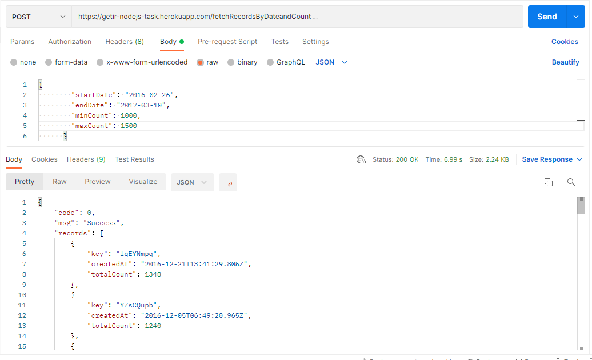
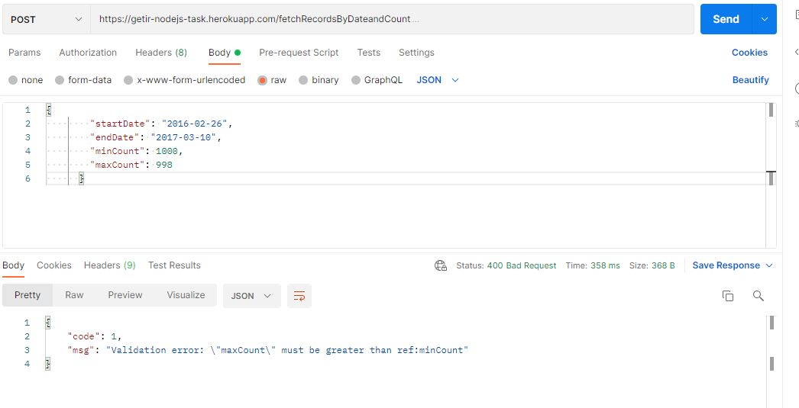

# Getir NodeJS RESTful API with MongoDB

The project is a RESTful API that is developed with NodeJS, ExpressJS and MongoDB stack. It has a single endpoint that fetches record data from the MongoDB collection and returns it in the desired form.

The single endpoint **"/fetchRecordsByDateandCount"**

## How to Run

For the first time

``` bash
$ npm install
```

After the first time only running below command is enough
```bash
$ npm start
```

Running testing with Jest
```bash
$ npm test
```

## Config Variables

```bash
DATABASE_URL=
PORT=
```

## Request Payload (Input)

**startDate:** Minimum value for createdAt attribute <br />
**endDate:** Maximum value for createdAt attribute <br />
**minCount:** Minimum value for sum of counts which sums up to totalCount <br />
**maxCount:** Maximum value for sum of counts which sums up to totalCount <br />

```bash

{
  startDate: Date,
  endDate: Date,
  minCount: Number,
  maxCount: Number,
}

```
## Response Payload (Output)

**code:** Status code of response payload which is hardcoded  <br />
**msg:** Return message of status  <br />
**records:** Record data from database collection  <br />
**key:** Unique key for spesific record  <br />
**createdAt:** Date that record is created  <br />
**totalCount:** Sum of the counts array attribute of that record  <br />

```bash

{
  code: Number,
  msg: String,
  records:[
    {
      key: String,
      createdAt: Date,
      totalCount: Number
    }
    
    ...
  ]
  ```
   
  ## Errors
  
  | Code    | Error Description                        |
|----------|---------------------------------------|
| 1 | <p> Validation Error </p> |
| 2 | <p> Database Error </p> |
| 3 | <p> Only post requests are allowed </p> |
| 4 | <p> Route not found </p> |
  

## Directories

### `index.js`
Server is running on port and listens for requests

### `/routes`
Single endpoint post request is defined here with data validation and database aggregation

### `/models`
Record database schema defined here

### `/middleware`
Request payload data validation is done here with Joi npm package

### `/database`
Database connection with MongoDB done here.

### `/controller`
Database aggregation for response payload done here.

### `/tests/integration`
Integration testing for data fetch, data validation and route request done here.

## Examples

`Running example with correct formed input`




`Running example with wrong formed input`




